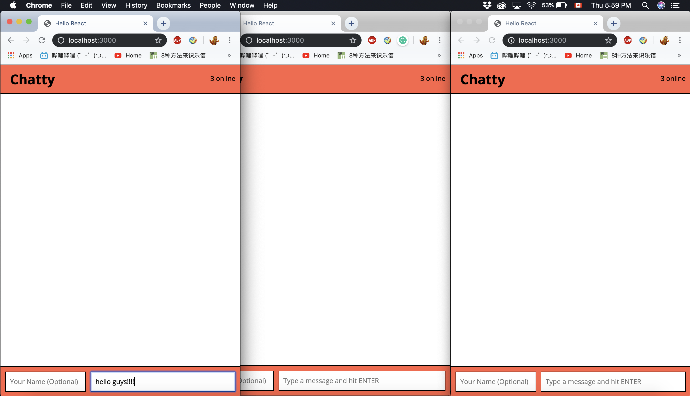
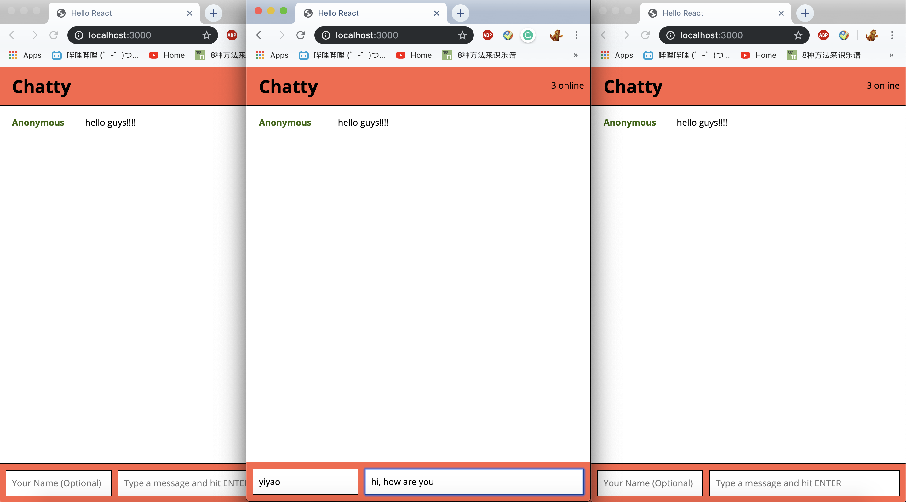
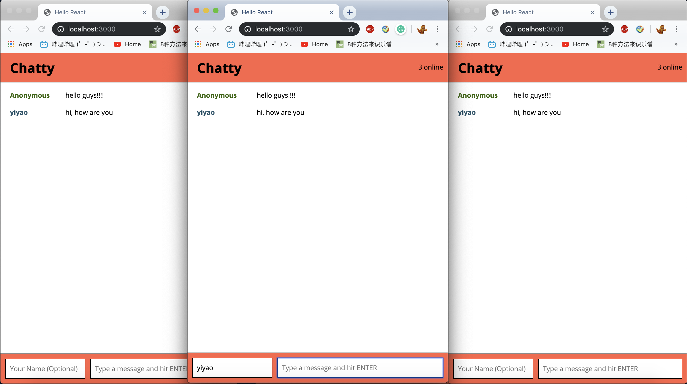
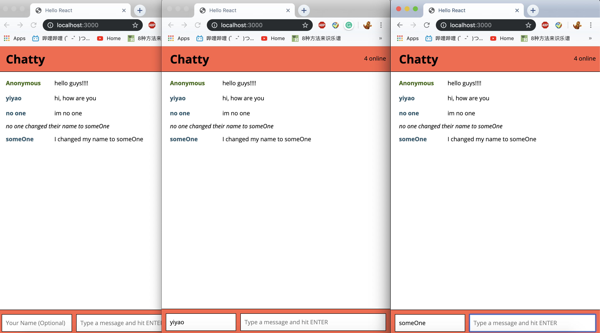
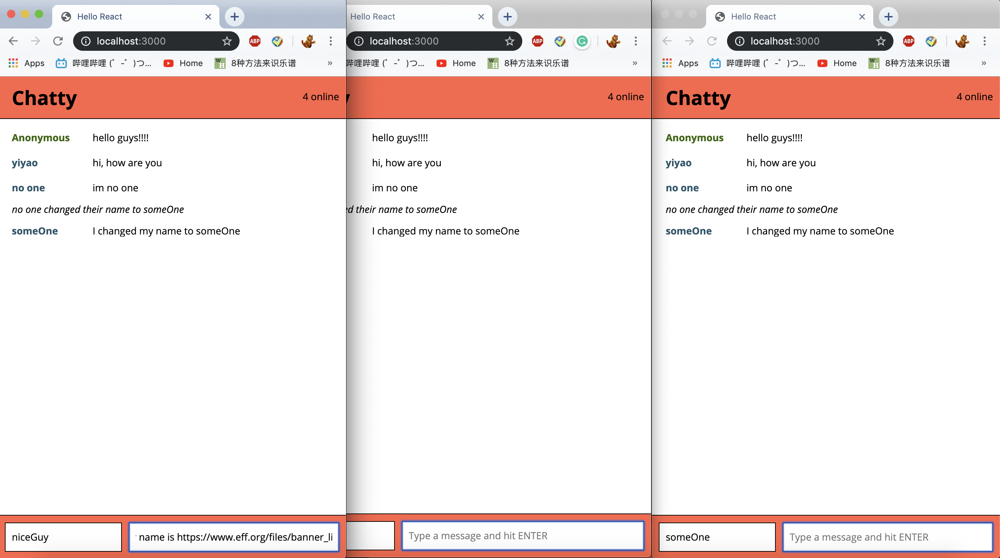
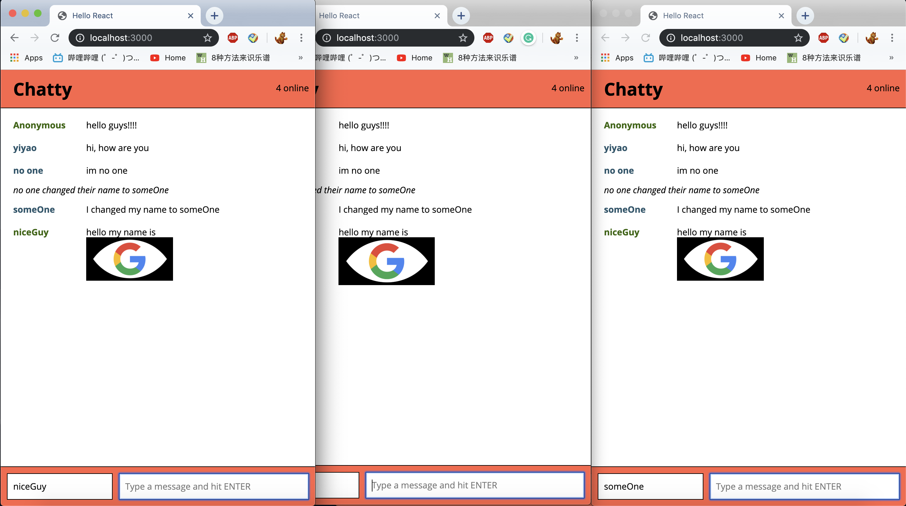
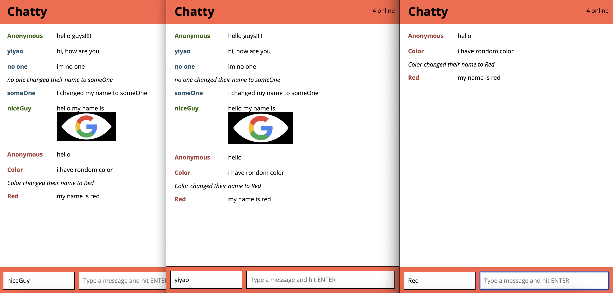

Chatty-app
=====================

A full stack app using React as front-end,express as back-end, webstocket as 3rd party severs

### Usage

```
git clone git@github.com:lighthouse-labs/react-simple-boilerplate.git
cd react-simple-boilerplate
```
Install the dependencies and start the server.

```
npm install
npm start
open http://localhost:3000
```
then install the severs side
* go chattySevers folder
```
npm install
npm start
```
* severs should listen to localhost:3001
### Dependencies

* React
* Webpack
* [babel-loader](https://github.com/babel/babel-loader)
* [webpack-dev-server](https://github.com/webpack/webpack-dev-server)
* expressjs
* webstocket
### feature
* user can chat each other
* if name part is empty the name will be 'Anonymous'
* if user change names, a notifiction will send to everyone who is online
* when a suer connect to the severs it will randomly get a color for their name
* user can send pic (1 only,if more than one will only show 1st one)
* user cant send blank or all space
* user can see how many people online
### final view

***

***

***

***

***

***

***

***

***

